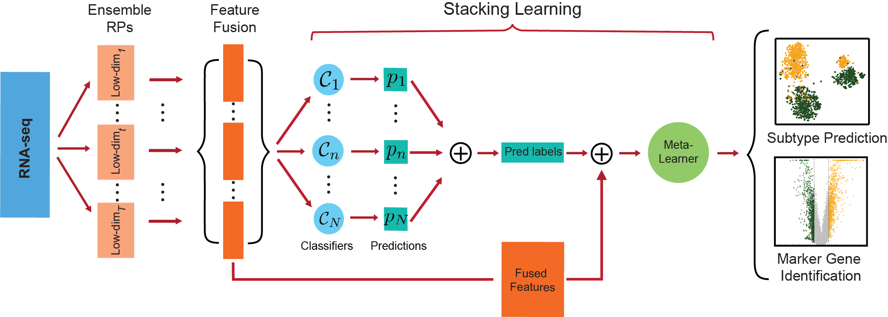

# RPSLearner: A novel approach combining <ins>R</ins>andom <ins>P</ins>rojection and <ins>S</ins>tacking <ins>Learn</ins>ing for categorizing NSCLC

In this study, to address the concerns in NSCLC subtype prediction, we developed RPSLearner which combines RP and stacking learning for effective and accurate classification. It effectively reduced the dimensionality while preserving sample-to-sample distances through RP and integrated fused features and predictions from diverse models through stacking learning. RPSLearner succeeds in boosting classification prediction with higher accuracy, F1 and AUC metrics than conventional machine learning models and state-of-the-art methods. RPSLearner utilized feature fusion strategy which exhibited better performance than score ensemble approaches in subtype prediction. RPSLearner’s results are interpretable that the expression of DEGs aligns well with the published literature, which also offering insights about potential novel biomarkers. This framework could be potentially extended to subtype identification of other cancers.

## Flowchart of RPSLearner


## Table of Contents
- [Installation](#installation)
- [Tutorials](#Tutorials)
- [Bug Report](#Bug-Report)
- [Authors](#Authors)
- [Publication](#Publication)

## Installation

## Tutorials
How to use the method for RNA-seq data

```python
# Usage Example for RPSLearner

import pandas as pd
from RPSLearner import RPSLearner
from sklearn.model_selection import train_test_split
from sklearn.metrics import classification_report, accuracy_score

data = pd.read_csv('data/rnaseq_tcga.csv')

tpm = data.drop('Subtype', axis=1)
subtype = data['Subtype'] # Use '0' for LUAD, and '1' for LUSC

metrics, y_probs, y_labels = RPSLearner(
    tpm.values, subtype, n_jobs=5)
```

## Bug Report
If you find any bugs or problems, or you have any comments on RPSLearner, please don't hesitate to contact via email xwu@unmc.edu

## Authors
Xinchao Wu, Shibiao Wan

## Publication

## License 

[](https://www.gnu.org/licenses/gpl-3.0)

GNU GENERAL PUBLIC LICENSE  
Version 3, 29 June 2007

This program is free software: you can redistribute it and/or modify
it under the terms of the GNU General Public License as published by
the Free Software Foundation, either version 3 of the License, or
(at your option) any later version.

This program is distributed in the hope that it will be useful,
but WITHOUT ANY WARRANTY; without even the implied warranty of
MERCHANTABILITY or FITNESS FOR A PARTICULAR PURPOSE.  See the
GNU General Public License for more details.

You should have received a copy of the GNU General Public License
along with this program.  If not, see <https://www.gnu.org/licenses/>.
